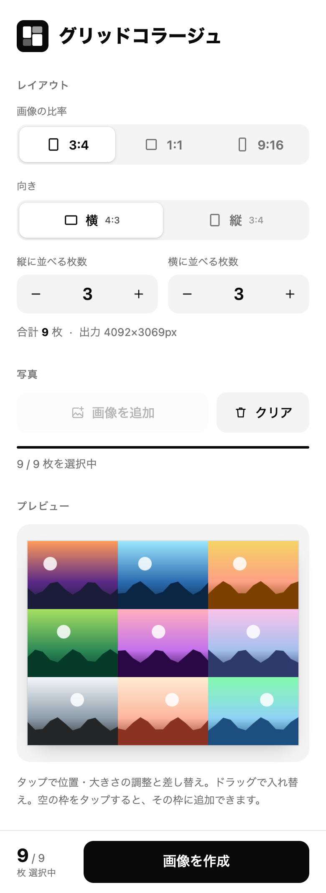

# グリッドコラージュ

写真を縦横のマス目に、**すきまなく・枠なしで**敷き詰めて1枚の画像にするWebアプリです。最大 10×10 = 100枚まで対応し、スマホのブラウザで使うことを想定しています。

**▶ アプリを開く: https://shumaikunkun.github.io/grid-collage**



## 特長

- **最大 10×10 = 100枚**。縦・横の枚数をそれぞれ 1〜10 で選べます
- **すきま・枠なし**。写真は枠にぴったり収まります
- **比率は 3:4 / 1:1 / 9:16** から選べます（縦向き・横向きも切り替え可能）
- **jpg / png / HEIC** に対応（iPhone の写真もそのまま使えます）
- **1枚ごとに移動・拡大縮小**。写真の見せたい部分を指で調整できます
- **ドラッグで並べ替え**。空の枠へ動かすこともできます。「シャッフル」でランダムに入れ替えもできます
- 写真が足りなくても作成でき、**空の枠は白**で保存されます
- 写真は端末の中だけで処理します。**サーバーには送信されません**
- ライトモード / ダークモードに自動で対応します

## 使い方

1. **比率と向きを選ぶ**（初期値は 3:4・横）。1:1 のときは向きの選択はありません
2. **縦と横の枚数を選ぶ**。−/＋ボタンか、数字をタップして選びます
3. **「画像を選ぶ」**で写真ライブラリから複数枚を選びます。選んだ順に左上から並びます
   - 足りない分は「画像を追加」で足せます
   - 空の枠（＋）をタップすると、**その枠に**1枚追加できます
4. **並べ替え・調整**をします
   - **ドラッグ**: ほかの枠と入れ替え（空の枠へ移動もできます）
   - **シャッフル**: プレビュー右上のボタンで、写真の位置をランダムに入れ替えます（空の枠はそのまま、調整した位置・大きさは写真について行きます）
   - **タップ**: 調整画面が開きます
     - ドラッグで移動、2本指のピンチまたはスライダーで拡大・縮小（1〜6倍）
     - 「画像を差し替え」でその枠だけ別の写真にできます
     - 「リセット」で中央・1倍に戻ります
5. **「画像を作成」**を押すと、できあがりが表示されます
6. **保存する**
   - 「カメラロールに保存」→ 共有メニューから「画像を保存」
   - 共有メニューが使えない環境では「ダウンロード」、または画像を長押しして保存します

### 向きが合わない写真について

選んだ向きと逆の写真（縦向きの枠に横向きの写真など）には、右上に「！」の印が付きます。枠に合わせて切り取られるので、タップして見せる位置を調整してください。

## 仕様

| 項目 | 内容 |
|---|---|
| 入力形式 | jpg / png / HEIC・HEIF。HEIC をブラウザが直接読めない場合（Chrome など）は、同梱のデコーダ（libheif）が別スレッドで並列に変換します。iPhone の Safari は端末の機能でそのまま読むため、変換は不要です |
| 出力形式 | JPEG（品質 0.92） |
| ファイル名 | `grid_collage_2026_1006_0528_0000.jpg`（年_月日_時分_ミリ秒） |
| 出力サイズの上限 | 一辺 4096px・1600万画素以内 |
| 作成できる条件 | 写真が1枚以上あること（空の枠は白） |

出力サイズの例（10×10 のとき）:

| 比率 | サイズ |
|---|---|
| 3:4 縦向き | 3060 × 4080 px |
| 1:1 | 4000 × 4000 px |
| 9:16 縦向き | 2250 × 4000 px |

枚数が多いほど、1枚あたりの解像度は小さくなります。また、メモリを節約するため、作成に使う写真は長辺 1600px に縮小して保持します。

写真を選ぶとまず一覧用の小さな画像だけを素早く作り、作成用の画像は裏で順に準備します（別スレッドで並列に処理するので、画面は止まりません）。

## 動作環境

iPhone の Safari、Android の Chrome など、最新のスマホブラウザを想定しています。PC のブラウザでも使えます。自動テストは Chrome（スマホの画面サイズ）で行っています。

## ローカルで動かす

ビルドは不要です。

```sh
git clone https://github.com/shumaikunkun/grid-collage.git
cd grid-collage
python3 -m http.server 8000
```

ブラウザで http://localhost:8000 を開きます。

## 公開する（GitHub Pages）

リポジトリの **Settings → Pages** で、Source を「Deploy from a branch」、Branch を `main` / `(root)` にして保存します。`https://<ユーザー名>.github.io/grid-collage` で公開されます。

## ファイル構成

```
index.html        画面
style.css         デザイン
app.js            アプリ本体
resources/        アイコン、スクリーンショット
image-worker.js   写真の読み込みと縮小を別スレッドで行うワーカー
heic-worker.js    HEIC を別スレッドで変換するワーカー
vendor/libheif/   同梱ライブラリ（libheif-js）
```

## 使用ライブラリ

- [libheif-js](https://github.com/catdad-experiments/libheif-js) 1.23.5（LGPL-3.0）: HEIC のデコードに使います。ブラウザが HEIC を直接読めないときだけ読み込まれます。無改変のまま `vendor/libheif/` に置き、ライセンス文書も同梱しています
